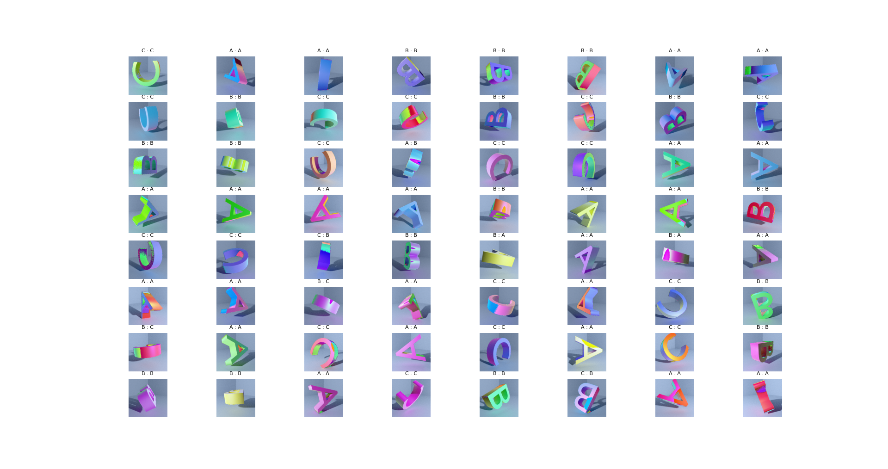

# End to end deep learning with synthetic data generation

## Table of contents
- [End to end deep learning with synthetic data generation](#end-to-end-deep-learning-with-synthetic-data-generation)
  - [Table of contents](#table-of-contents)
  - [Setup](#setup)
  - [Example result](#example-result)

## Setup
```
git clone <origin-url> && cd letters
make data
make train
make test
```
## Example result

